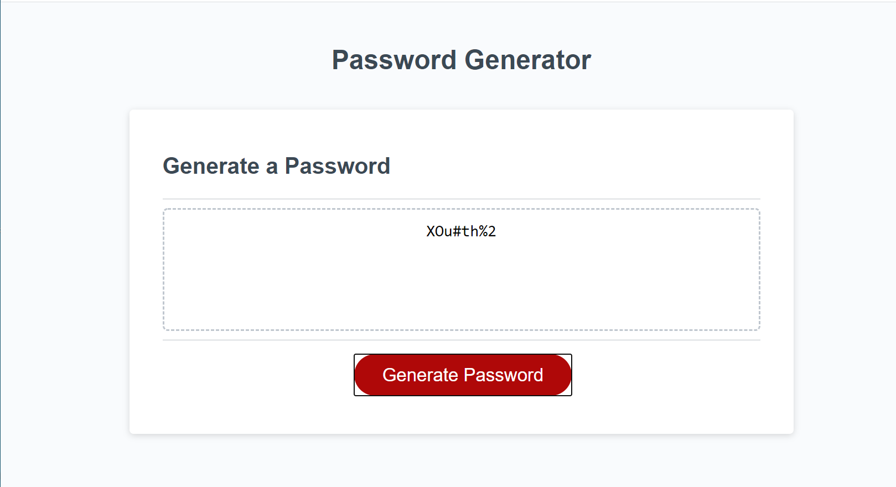

# Password Generator Starter Code

Live URL:  https://augustinandrea.github.io/friendly_parakeet/Develop

GitHub Repository: https://github.com/augustinandrea/friendly_parakeet

The main goal of the challenge is to generate a password. When generating a password there will be a series of prompts that help create the password. There are multiple alerts that show up and ask if you want uppercase, lowercase, numbers, or special characters in the password. If all the alerts are responded with cancel, then an alert saying that there are too few options will pop-up.
